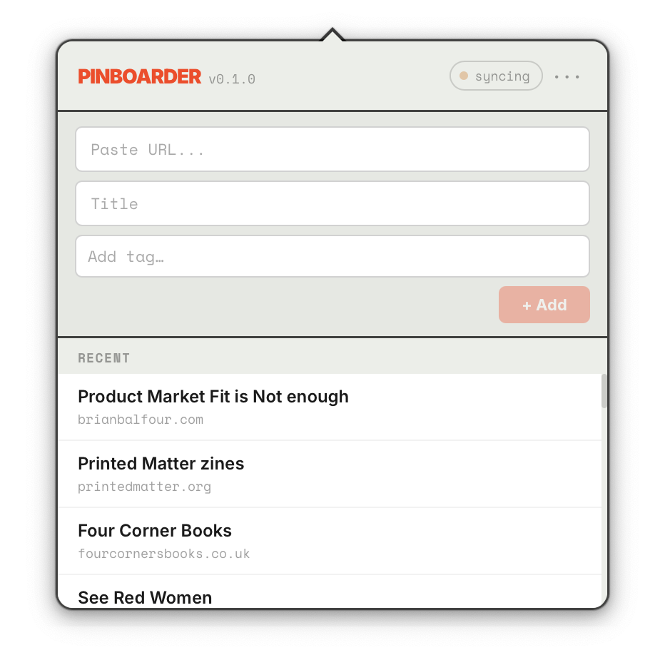

# Pinboarder



A retro-modern themed macOS menubar app for [Pinboard](https://pinboard.in).

**[Download v0.1.0](https://github.com/inosaint/pinboarder/releases/tag/v0.1.0)**

## Features

- Open from the macOS menu bar
- Add websites instantly to your Pinboard using URLs
- Titles fetched automatically from the page
- Tags suggested from your existing library
- Edit and delete bookmarks inline
- Background sync every 3 minutes; manual "Sync now" available
- API token stored encrypted via Tauri Stronghold (never in plaintext)

## Setup

1. Open the app — the panel appears from the menu bar icon
2. Paste your Pinboard API token (`username:TOKEN`)
   → Find it at [pinboard.in/settings/password](https://pinboard.in/settings/password)
3. The app syncs your bookmarks and is ready to use

## Requirements

macOS 13 Ventura or later.

## Development

```bash
npm install
npm run tauri dev
```

## Tech

- Designed using [Variant.com](https://variant.com/)
- Logo made with [Quiver.ai](https://quiver.ai/)
- Coded by Codex and Claude Code
- [Tauri v2](https://tauri.app) + React 19 + TypeScript
- SQLite (via `rusqlite`) for local bookmark cache
- [Tauri Stronghold](https://github.com/tauri-apps/tauri-plugin-stronghold) for encrypted token storage
- Pinboard v1 API (`posts/all`, `posts/add`, `posts/delete`, `tags/get`)
- [Inter](https://rsms.me/inter/) — UI chrome and structural elements
- [Space Mono](https://fonts.google.com/specimen/Space+Mono) — data, inputs, and instructional text
- [Material Symbols](https://fonts.google.com/icons) by Google — history icon (Apache 2.0)
