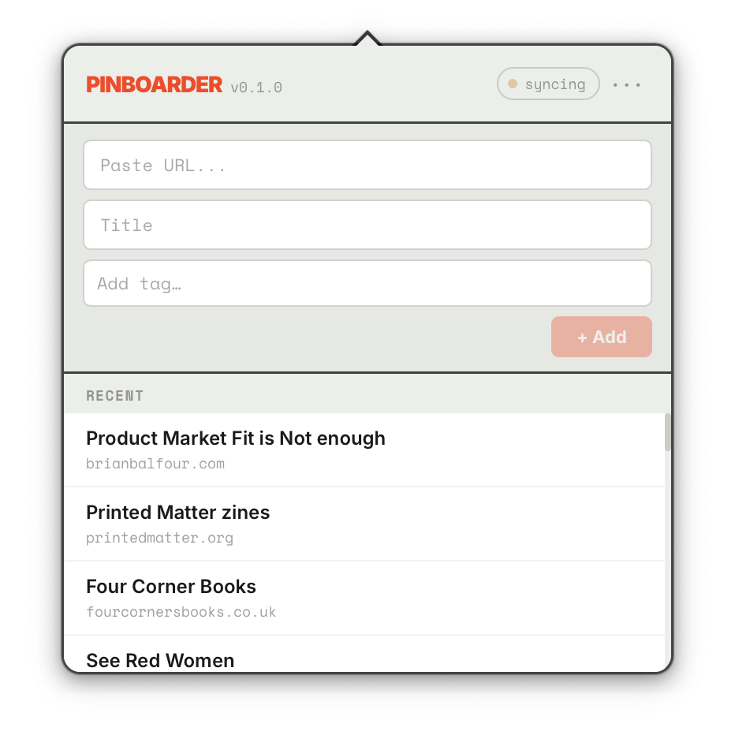

# Pinboarder



A retro-modern themed macOS menubar app for [Pinboard](https://pinboard.in).

**[Download v0.1.0](https://github.com/inosaint/pinboarder/releases/tag/v0.1.0)**

## Features

- Open from the macOS menu bar
- Add websites instantly to your Pinboard using URLs
- Titles fetched automatically from the page
- Tags suggested from your existing library
- Optional: [Jev](https://docs.typesafe.ai) picks the right tags from your library for each new link
- Edit and delete bookmarks inline
- Background sync every 3 minutes; manual "Sync now" available
- API keys stored in the macOS Keychain, never in plaintext or in the app's web layer

## Setup

### Install

1. Download `Pinboarder_x.y.z_universal.dmg` from the [latest release](https://github.com/inosaint/pinboarder/releases/latest) and drag Pinboarder into Applications
2. Pinboarder isn't notarised by Apple, so macOS blocks it the first time. Open it once with **right-click → Open → Open**, or run:
   ```bash
   xattr -dr com.apple.quarantine /Applications/Pinboarder.app
   ```
   After that it opens normally.

### Connect Pinboard

1. Click the menu bar icon to open the panel
2. Paste your Pinboard API token (`username:TOKEN`)
   → Find it at [pinboard.in/settings/password](https://pinboard.in/settings/password)
3. The app syncs your bookmarks and is ready to use

### Jev tag suggestions (optional)

1. Get an API key from [TypeSafe](https://docs.typesafe.ai)
2. In the panel, open **••• → Add Jev API Key…** and paste it
3. When you paste a URL, Jev picks matching tags from your existing library. If you're offline or out of Jev usage, the app keeps working without it.

### Keychain prompts

Your Pinboard token and Jev key are stored in the macOS Keychain. After installing a new version, macOS may ask whether Pinboarder can access them. Choose **Always Allow**.

## Requirements

macOS 13 Ventura or later.

## Development

```bash
npm install
npm run tauri dev
```

### Building

```bash
npm run build:signed    # personal build, signed with your Apple Development certificate
npm run build:release   # ad-hoc signed universal .dmg (Apple Silicon + Intel) for GitHub releases
```

`build:signed` reads your certificate name from `.env.local` (gitignored):

```bash
APPLE_SIGNING_IDENTITY="Apple Development: you@example.com (TEAMID)"
```

Find yours with `security find-identity -v -p codesigning`. The release `.dmg` lands in `src-tauri/target/universal-apple-darwin/release/bundle/dmg/`.

## Tech

- Designed using [Variant.com](https://variant.com/)
- Logo made with [Quiver.ai](https://quiver.ai/)
- Coded by Codex and Claude Code
- [Tauri v2](https://tauri.app) + React 19 + TypeScript
- SQLite (via `rusqlite`) for local bookmark cache
- macOS Keychain (via [`keyring`](https://crates.io/crates/keyring)) for API key storage
- [TypeSafe Jev](https://docs.typesafe.ai) for tag selection (optional)
- Pinboard v1 API (`posts/all`, `posts/add`, `posts/delete`, `tags/get`)
- [Inter](https://rsms.me/inter/) — UI chrome and structural elements
- [Space Mono](https://fonts.google.com/specimen/Space+Mono) — data, inputs, and instructional text
- [Material Symbols](https://fonts.google.com/icons) by Google — history icon (Apache 2.0)
